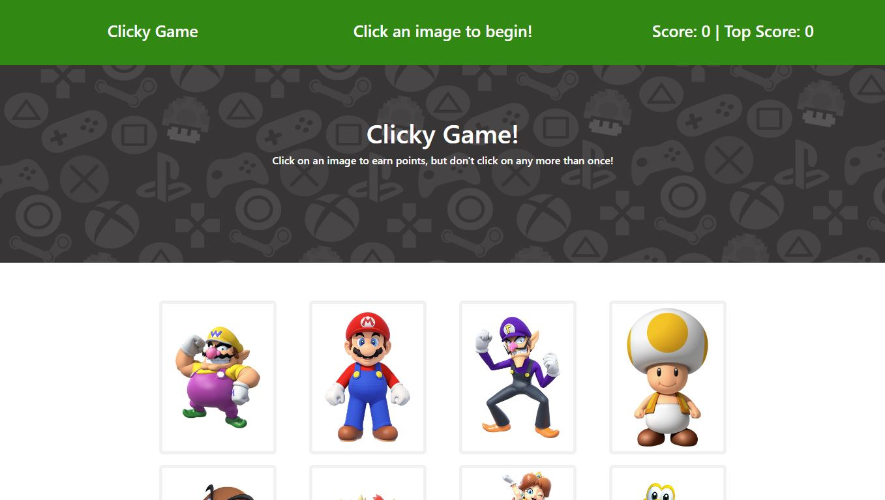

# clicky-game

## Overview

The Clicky Game is a React application designed to test and enhance memory skills. Users are presented with a grid of images, and their objective is to click on each image only once. The game keeps track of the user's score and shuffles the images after every click. This project focuses on building a memory game using React components, managing component state, and handling user events.

## Table of Contents

- [Overview](#overview)
- [Demo and Screenshots](#demo-and-screenshots)
- [Features](#features)
- [Technologies Used](#technologies-used)

## Demo and Screenshots

The [URL](...) of deployed application.

## Features

- Interactive memory game with React
- Score tracking system
- Image shuffling after each click
- User-friendly interface

## Technologies Used

- React
- Bootstrap
- JavaScript
- CSS

## License

N/A